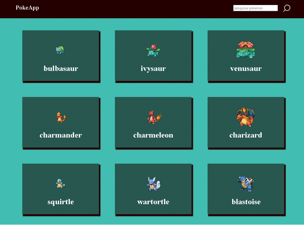

<h2> api consumption2 - Poke Api</h2>

 Esse projeto é um site simples integrado com a <a href="https://pokeapi.co">poke api </a> (api para ter acesso a pokemons, com suas habilidades, itens, etc). De forma simples, somente listei os pokemons e seus ícones.
 

-> Características/funcionalides:

<ul>
    <li>usei uma lib bem interessante, que é a <a href="https://github.com/lokesh/color-thief">Color Thief</a>, que obtém a paleta de cores de uma imagem. Não ficou com um design muito bonito, mas achei bem legal a ferramenta, então utilizei mesmo assim.</li>
    <li>O backend do site foi feito com flask</li>
</ul>

  

